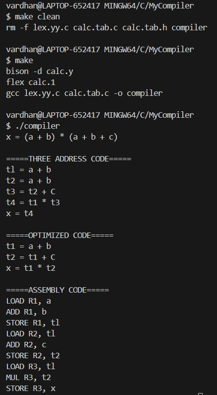
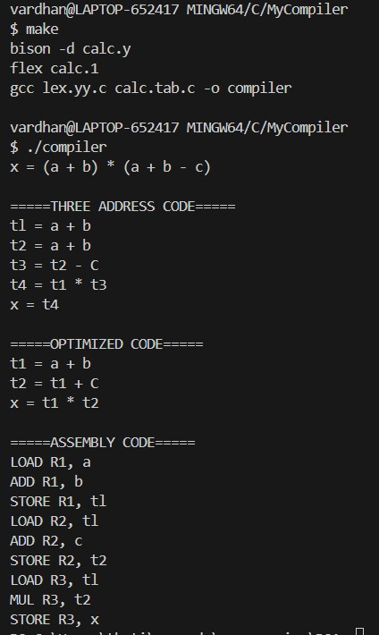

# MyCompiler_22115114
```markdown
# ⚙️ Arithmetic Expression Compiler (Flex + Bison + C++)

This project is a simple arithmetic compiler that parses algebraic expressions and generates:

- ✅ Three Address Code (TAC)
- 🔁 Optimized Instructions
- 🖥️ Register-Based Assembly Code

Built using **Flex**, **Bison**, and **C++**, this project showcases basic compiler design, optimization techniques, and code generation.

---
✅ **Valid Input**:
```c
x = (a + b) * (a + b + c);
```
## 🖥️ Sample Output

**Input**:
```c
x = (a + b) * (a + b + c);
```

**Output**:
```
===== THREE ADDRESS CODE =====
t1 = a + b
t2 = t1 + c
x = t1 * t2

===== OPTIMIZED CODE =====
t1 = a + b
t2 = t1 + c
x = t1 * t2

===== ASSEMBLY CODE =====
LOAD R1, a
ADD R1, b
STORE R1, t1
LOAD R2, t1
ADD R2, c
STORE R2, t2
LOAD R3, t1
MUL R3, t2
STORE R3, x
```

## 🛠️ How to Use

1. **Build the compiler**:
```bash
make clean && make
```

2. **Run with input**:
```bash
# Method 1: Pipe input
echo "x = (a + b) * (a + b + c);" | ./compiler

# Method 2: Interactive mode
./compiler
> x = (a + b) * (a + b + c);
> [Press CTRL+D to process]
```

## 🐛 Troubleshooting

If you get "syntax error":
1. Check for missing semicolon
2. Remove any trailing characters
3. Use only single-letter variables
4. Supported operators: `+`, `-`, `*`

## 📸 Screenshots




## 📸 Github link
https://github.com/manivardhan23032005/22115114_cd

The above are the two examples
---
---
## 📜 License
MIT License - Free for academic and commercial use
```

Key improvements:
1. **Clear syntax requirements** upfront
2. **Fixed examples** showing proper usage
3. **Troubleshooting section** for common errors
4. **Simplified instructions** for running
5. **Removed invalid syntax** from examples

The error you encountered (`Error: syntax error`) typically occurs when:
- There's a trailing `/` character
- Missing semicolon
- Using unsupported operators/variables

Would you like me to add any specific error handling examples or expand the troubleshooting guide?

